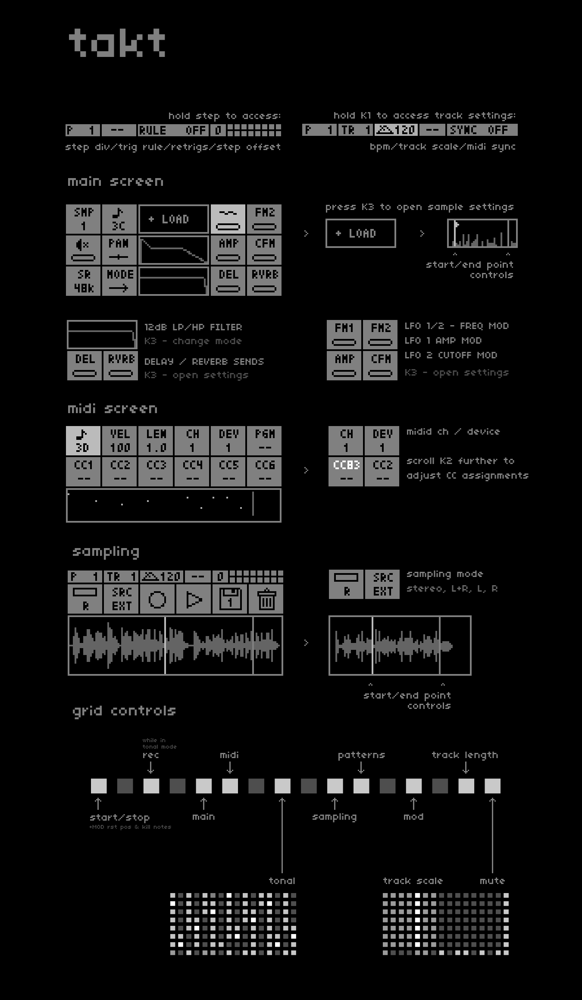

# takt2
updates to the monome takt script to incorporate global clock updates etc.
original documentation below

Current additions:
- updated to global clock
- will sync to Ableton Link and crow
- will send sync via crow
- can select 1-4 MIDI devices as a synth output 
- can select JF via crow as a synth output 
- can selet W/syn via crow as an output 
- W/syn paramters can be edited as part of the patch
- can select chords of various types instead of just single notes on syth page
- chord types can be p-locked, just like notes

To Do:
- further adjust synth page depending on output for the track
- replace PGM with ARP for JF?
- replace CC controls with Arp controls for JF? 
- enable W/syn PGM to load various presets?
- replace CC controls with W/Syn controls for W/syn
- enable Linn input for JF and W/syn
- enable crow output
- enable CC values to be an LFO instead of a fixed value 
- add a bunch of LFOs that can be controlled via Params?

Current issues:

- metronome seems to get faster when the tempo slows down 
- some crockles occasionally - maybe compare cpu load to original takt
- Linn input on grid doesn't play JF or W/syn

